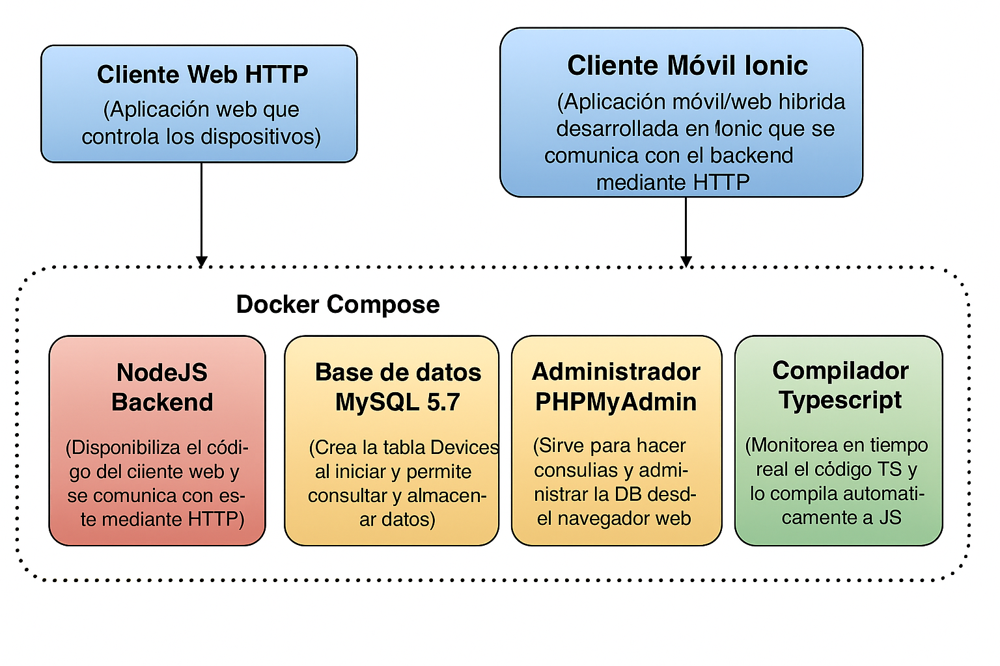
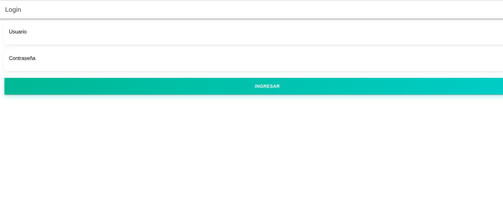
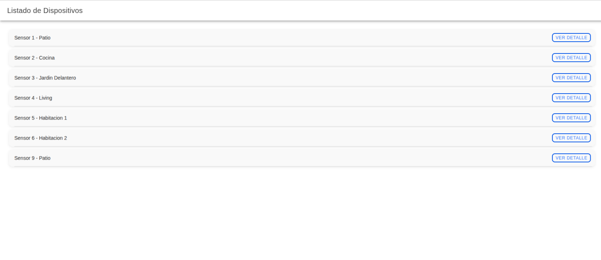
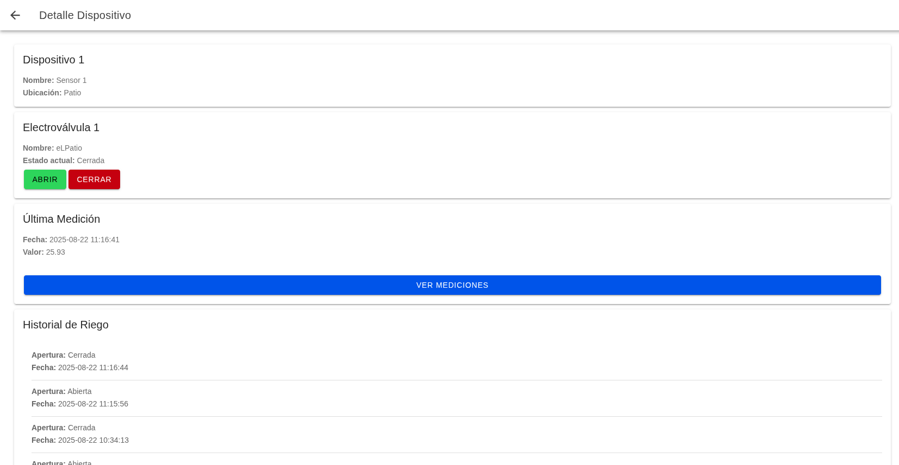
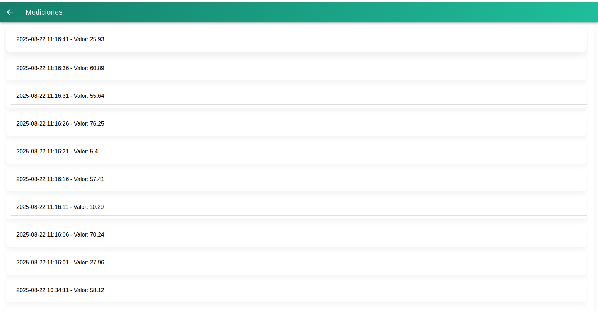

<a href="https://www.gotoiot.com/">
    
</a>

# app-Ionic
Web App Full Stack IoT usando Docker, Express, Sequelize, Ionic, Winston, MySQL y más.
## Aplicaciones Web 2
### Entrega Final - Ing. Diego Vazquez

### Tecnologías principales
Docker & Docker Compose – Para contenerizar la app, DB, compilador y admin.

Node.js + Express – Backend REST con estructura de controladores y rutas.

Sequelize – ORM para interactuar con MySQL.

Winston – Sistema de logging avanzado (archivo + consola), con timestamps en zona horaria de BA.

Morgan – Logging de peticiones HTTP.

IONIC – UI del frontend.

TypeScript – Código frontend tipado compilado con Docker.

MySQL 5.7 + PHPMyAdmin – Base de datos relacional.

### Estructura del proyecto

```sh
├── db/  
│   ├── dumps/  
│   │   └── DAM.sql                # esquema inicial con tabla Devices  
│   └── data/                      # datos persistentes de MySQL  
├── src/  
│   ├── backend/
│   │   ├── log/                   # log del backend
│   │   │   └── DAM.log
│   │   ├── controllers/           # lógica de negocio separada  
│   │   │   └── DevicesController.js
│   │   │   └── ElectrovalvulaController.js
│   │   │   └── MedicionController.js
│   │   │   └── Log_RiegoController.js  
│   │   ├── routes/                # definiciones de rutas  
│   │   │   └── routesDevice.js
│   │   │   └── routesElectrovalvula.js
│   │   │   └── routesMedicion.js
│   │   │   └── routesLog_Riego.js  
│   │   ├── utils/  
│   │   │   ├── logger.js          # Winston + path + momento  
│   │   │   └── sanitize.js  
│   │   ├── models/                # definiciones Sequelize  
│   │   │   └── Device.js
│ 	│ 	│ 	└── Electrovalvula.js
│ 	│ 	│ 	└── Medicion.js
│ 	│ 	│ 	└── Log_Riego.js
│   │   ├── bd/                    # conexión Sequelize a MySQL  
│   │   │   └── awdb.js  
│   │   ├── index.js               # arranque de Express + middlewares  
│   └── frontend/  
│       ├── login/                    
│       ├── listado-dipositivos/                     
│       ├── dispositivo/
│       ├── electrovalvula/
│       ├── medicion/
│       ├── log-riego/
│       ├── guards/
│       └── index.html  
└── docker-compose.yml  
```

### Arquitectura de la aplicación

La aplicación se ejecuta sobre el ecosistema Docker,  diagrama de arquitectura:




## Cómo arrancar la app

### Instalar las dependencias

Para correr este proyecto es necesario que instales `Docker` y `Docker Compose`. 

En [este artículo](https://www.gotoiot.com/pages/articles/docker_installation_linux/) publicado en nuestra web están los detalles para instalar Docker y Docker Compose en una máquina Linux. Si querés instalar ambas herramientas en una Raspberry Pi podés seguir [este artículo](https://www.gotoiot.com/pages/articles/rpi_docker_installation) de nuestra web que te muestra todos los pasos necesarios.

En caso que quieras instalar las herramientas en otra plataforma o tengas algún incoveniente, podes leer la documentación oficial de [Docker](https://docs.docker.com/get-docker/) y también la de [Docker Compose](https://docs.docker.com/compose/install/).

Continua con la descarga del código cuando tengas las dependencias instaladas y funcionando.


### Cloná el repositorio:
```
git clone https://github.com/dvazquez1981/DAM.git
```

### Arrancá todo con Docker Compose:
docker compose up 

### Estructura de la DB
Al iniciar el servicio de la base de datos, si esta no está creada toma el archivo que se encuentra en `db/dumps/smart_home.sql` para crear la base de datos automáticamente.
En ese archivo está la configuración de la tabla `Devices` y otras configuraciones más. Si quisieras cambiar algunas configuraciones deberías modificar este archivo y crear nuevamente la base de datos para que se tomen en cuenta los cambios.
Tené en cuenta que la base de datos se crea con permisos de superusuario por lo que no podrías borrar el directorio con tu usuario de sistema, para eso debés hacerlo con permisos de administrador. En ese caso podés ejecutar el comando `sudo rm -r db/data` para borrar el directorio completo.


### Accedé al frontend en:
http://localhost:8100

### Accedé al PHPMyAdmin en: 
http://localhost:8001 (credenciales root / userpass).


### Configuración de la DB
Para el caso del servicio de NodeJS que se comunica con la DB fijate que en el archivo `src/backend/awdb.js` están los datos de acceso para ingresar a la base.
Si quisieras cambiar la contraseña, puertos, hostname u otras configuraciones de la DB deberías primero modificar el servicio de la DB en el archivo `docker-compose.yml` y luego actualizar las configuraciones para acceder desde PHPMyAdmin y el servicio de NodeJS.

### Estructura de la DB
Al iniciar el servicio de la base de datos, por mas que este creada conviene tomar el archivo que se encuentra en `db/dumps/DAM.sql` y actualizar la base de datos en phpmyadmin.
En ese archivo está la configuración de la tabla `Devices`, `Mediciones`, `Electrovalvulas`, `Log_Riego` y  `Usuario` y otras configuraciones más. Si quisieras cambiar algunas configuraciones deberías modificar este archivo y crear nuevamente la base de datos para que se tomen en cuenta los cambios.

Tené en cuenta que la base de datos se crea con permisos de superusuario por lo que no podrías borrar el directorio con tu usuario de sistema, para eso debés hacerlo con permisos de administrador. En ese caso podés ejecutar el comando `sudo rm -r db/data` para borrar el directorio completo.


## Backend

### Rutas disponibles

---

### Device: lógica CRUD usando Sequelize
- `GET /device` → devuelve todos los dispositivos  
- `GET /device/:dispositivoId` → devuelve un dispositivo por ID (verifica que el ID sea numérico y que exista)  
- `POST /device` → recibe JSON con `{ nombre, ubicacion, electrovalvulaId }`  
  - valida que no exista duplicado por nombre  
  - valida que `electrovalvulaId` sea numérico y exista  
- `PATCH /device/:dispositivoId` → actualiza un dispositivo (verifica ID numérico y existencia, y lo mismo con `electrovalvulaId` si se actualiza)  
- `DELETE /device/:dispositivoId` → elimina un dispositivo por ID (verifica ID numérico)  

---

### Medición: lógica CRUD usando Sequelize
- `GET /medicion` → devuelve todas las mediciones  
- `GET /medicion/:medicionId` → devuelve una medición específica por ID  
- `GET /medicion/dispositivo/:dispositivoId` → devuelve las mediciones de un dispositivo (valida ID numérico y existencia del dispositivo)  
- `GET /medicion/ultima/:dispositivoId` → devuelve la última medición de un dispositivo (misma validación)  
- `POST /medicion` → recibe JSON con `{ valor, fecha, dispositivo }`  
  - valida que exista el dispositivo  
  - valida que no haya duplicado por `(fecha, dispositivo)`  
- `PATCH /medicion/:medicionId` → actualiza una medición (verifica ID numérico y existencia, y si se actualiza dispositivo valida que exista)  
- `DELETE /medicion/:medicionId` → elimina una medición (verifica ID numérico)  
- `DELETE /medicion/dispositivo/:dispositivoId` → elimina todas las mediciones de un dispositivo (verifica ID numérico y existencia)  

---

### Log_Riego: lógica CRUD usando Sequelize
- `GET /log_riego` → devuelve todos los logs de riego  
- `GET /log_riego/:electrovalvulaId` → devuelve los logs de una electrovalvula (valida ID numérico y existencia)  
- `POST /log_riego` → recibe JSON con `{ fecha, apertura, electrovalvulaId }`  
  - valida duplicado por `(fecha, electrovalvulaId)`  
  - valida que `electrovalvulaId` sea numérico y exista  
- `PATCH /log_riego/:logRiegoId` → actualiza un log (valida ID numérico y existencia, y lo mismo con `electrovalvulaId` si se actualiza)  
- `DELETE /log_riego/:logRiegoId` → elimina un log (valida ID numérico)  

---

### Usuario: lógica CRUD usando Sequelize
- `GET /usuario` → devuelve todos los usuarios  
- `GET /usuario/:userId` → devuelve un usuario por ID (valida que sea numérico y exista)  
- `POST /usuario/login` → login con JSON `{ usuario, password }`  
  - si es válido, devuelve token  
  - también soporta login solo con token válido  
- `POST /usuario` → recibe JSON con `{ usuario, password }`  
  - valida duplicado por usuario  
- `DELETE /usuario/:userId` → elimina un usuario (valida ID numérico)  


### validacion token:
Salvo el End point de login en usuario, todos los demas  utilizan para validar el token suministrado.

### Sanitizacion:
La Sanitizacion de los los end points es tanto a la entrada como a la salida.

### Controladores:
- Archivo: src/backend/controllers/DeviceController.js
- Archivo: src/backend/controllers/MedicionController.js
- Archivo: src/backend/controllers/ElectrovalvulaController.js
- Archivo: src/backend/controllers/Log_riegoController.js
- Archivo: src/backend/controllers/UsuarioController.js

### logger
- Logger (utils/logger.js):
- Tiempo real con Winston (archivo + consola).
- Timestamps en America/Argentina/Buenos_Aires.
- Archivos de log en src/backend/log/DAM.log.
- Consola estilo dev + JSON en producción.
- Morgan: middleware que agrega logging de requests HTTP.

### Conexión a base de datos (Sequelize)
- Archivo: src/backend/bd/awdb.js 

### Modelo Sequelize
- Archivo: src/backend/models/Device.js
- Archivo: src/backend/models/Medicion.js
- Archivo: src/backend/models/Electrovalvula.js
- Archivo: src/backend/models/Log_riego.js
- Archivo: src/backend/models/Usuario.js


## Frontend
El cliente web es una Single Page Application (SPA) desarrollada en Ionic con Angular, utilizando los componentes nativos de Ionic y TypeScript para la tipificación del código.

Funcionalidades principales

- Login de usuario:
Permite iniciar sesión para acceder a las funcionalidades de la app.

- Listado de dispositivos:
Visualiza todos los dispositivos registrados con información básica.

- Detalle de dispositivos:
Al seleccionar un dispositivo, se muestra información completa incluyendo:
Nombre, descripción y estado.

- Historial de logs de riego: fecha y estado de cada evento registrado.

- Prender o apagar electrovalvulas:
Posibilidad de apagar y prender electrovalvulas directamente desde la interfaz.
Simulación de mediciones asociadas al dispositivo.

- Ver todas las mediciones:
Botón para consultar y visualizar el historial completo de mediciones de todos los dispositivos y en el caso que este prendida la
electrovalvula se puede ver como se van actualizando.


### Frontend - Vistas

#### Login


Para ingresar al sistema:  
**Usuario:** `admin`  
**Contraseña:** `admin`

---

#### Listado de dispositivos


---

#### Detalle de dispositivo


Al activar la electrovalvula, la simulación de mediciones empezará a actualizar la última medición.

---

#### Detalle de medición



En el caso este si esta activada la electrovalvula se actualizaran las mediciones con las simuladas


## Log
Ejemplo de log (consola y en DAM.log):

```sh
[2025-06-21 14:20:00] : Servidor api rest esta corriendo
[2025-06-21 14:20:01] : Conexión a MySQL OK.
[2025-06-21 14:20:05] : Obtengo todos los dispositivos
[2025-06-21 14:21:03] : Se encontró device con id=2
```


# Detalles de implementación 💻

En esta sección se explican los detalles específicos de funcionamiento de cada recurso de la aplicación, tanto en el **frontend** como en el **backend**.  

---

### 📌 Dispositivo (Device)

#### Obtener todos los dispositivos (getAll)

Frontend:  
Cuando se carga la lista de dispositivos, se realiza un GET al backend.  
GET http://localhost:8000/device

Backend:  
- Función: getAll → src/backend/controllers/DevicesController.js  
- Ruta: GET /device  

Proceso:  
1. Log de acción (“Obtengo todos los dispositivos”).  
2. Consulta Sequelize Device.findAll().  
3. Sanitización de salida.  
4. Devuelve 200 OK con array JSON.  

Ejemplo respuesta:  
[
  { "id": 1, "nombre": "Cocina", "ubicacion": "Cocina", "electrovalvulaId": 1 },
  { "id": 2, "nombre": "Baño", "ubicacion": "Baño", "electrovalvulaId": 2 }
]

Errores:  
- 500 Internal Server Error.  

---

#### Obtener dispositivo por ID (getOne)
GET http://localhost:8000/device/:id

Backend:  
- Función: getOne  
- Proceso: valida id, busca con findOne, responde con 200 OK, 404 Not Found o 500.  

Ejemplo éxito:  
{ "id": 1, "nombre": "Cocina", "ubicacion": "Cocina", "electrovalvulaId": 1 }

Errores:  
- 400 → id inválido.  
- 404 → no existe.  
- 500 → error inesperado.  

---

#### Crear dispositivo (create)
POST http://localhost:8000/device

Request:  
{ "nombre": "Bomba agua", "ubicacion": "Jardín", "electrovalvulaId": 3 }

Respuesta:  
{ "message": "Device creado exitosamente", "data": { "id": 5, "nombre": "Bomba agua", "ubicacion": "Jardín", "electrovalvulaId": 3 } }

Errores:  
- 400 → campos inválidos.  
- 409 → nombre duplicado.  
- 404 → electrovalvulaId no existe.  
- 500 → error inesperado.  

---

#### Actualizar dispositivo (update)
PATCH http://localhost:8000/device/:id

#### Eliminar dispositivo (delete)
DELETE http://localhost:8000/device/:id

---

### 📌 Usuario  

#### Login usuario
POST http://localhost:8000/usuario/login

Request:  
{ "usuario": "admin", "password": "admin" }

Respuesta (token):  
{ "message": "Login correcto", "token": "eyJhbGciOi..." }

Errores:  
- 401 Unauthorized → credenciales inválidas.  
- 500 → error inesperado.  

---

#### Obtener todos los usuarios
GET http://localhost:8000/usuario

Devuelve array de usuarios (sin passwords).  

#### Crear usuario
POST http://localhost:8000/usuario

Request:  
{ "usuario": "diego", "password": "1234" }

Errores:  
- 409 Conflict → usuario ya existe.  
- 400 Bad Request → datos inválidos.  

#### Eliminar usuario
DELETE http://localhost:8000/usuario/:id

---

### 📌 Electrovalvula  

#### Obtener todas
GET http://localhost:8000/electrovalvula

#### Obtener por ID
GET http://localhost:8000/electrovalvula/:id

#### Crear electrovalvula
POST http://localhost:8000/electrovalvula

Request:  
{ "nombre": "Valvula patio", "estado": 0 }

#### Actualizar
PATCH http://localhost:8000/electrovalvula/:id

#### Eliminar
DELETE http://localhost:8000/electrovalvula/:id

Errores comunes:  
- 400 id inválido  
- 404 no existe  
- 409 duplicado  
- 500 error interno  

---

### 📌 Log de Riego (Log_Riego)

#### Obtener todos
GET http://localhost:8000/log_riego

#### Obtener por electrovalvulaId
GET http://localhost:8000/log_riego/:electrovalvulaId

#### Crear log
POST http://localhost:8000/log_riego

Request:  
{ "fecha": "2025-08-22 13:00:00", "apertura": 1, "electrovalvulaId": 2 }

Errores:  
- 400 datos inválidos  
- 409 duplicado fecha+electrovalvula  
- 404 electrovalvula no existe  

#### Actualizar / Eliminar
PATCH http://localhost:8000/log_riego/:id  
DELETE http://localhost:8000/log_riego/:id  

---

### 📌 Medición (Medicion)

#### Obtener todas
GET http://localhost:8000/medicion

#### Obtener por ID
GET http://localhost:8000/medicion/:id

#### Obtener por dispositivo
GET http://localhost:8000/medicion/dispositivo/:dispositivoId

#### Última medición de un dispositivo
GET http://localhost:8000/medicion/ultima/:dispositivoId

#### Crear medición
POST http://localhost:8000/medicion

Request:  
{ "valor": 55, "fecha": "2025-08-22 12:00:00", "dispositivo": 1 }

Errores:  
- 400 → campos inválidos  
- 409 → ya existe medición para ese dispositivo y fecha  
- 404 → dispositivo no existe  

#### Actualizar / Eliminar
PATCH http://localhost:8000/medicion/:id  
DELETE http://localhost:8000/medicion/:id  
DELETE http://localhost:8000/medicion/dispositivo/:dispositivoId


## Contribuir 🖇️

Si estás interesado en el proyecto y te gustaría sumar fuerzas para que siga creciendo y mejorando, podés abrir un hilo de discusión para charlar tus propuestas en [este link](https://github.com/gotoiot/app-fullstack-base/issues/new). Así mismo podés leer el archivo [Contribuir.md](https://github.com/gotoiot/gotoiot-doc/wiki/Contribuir) de nuestra Wiki donde están bien explicados los pasos para que puedas enviarnos pull requests.

## Sobre Goto IoT 📖

Goto IoT es una plataforma que publica material y proyectos de código abierto bien documentados junto a una comunidad libre que colabora y promueve el conocimiento sobre IoT entre sus miembros. Acá podés ver los links más importantes:

* **[Sitio web](https://www.gotoiot.com/):** Donde se publican los artículos y proyectos sobre IoT. 
* **[Github de Goto IoT:](https://github.com/gotoiot)** Donde están alojados los proyectos para descargar y utilizar. 
* **[Comunidad de Goto IoT:](https://groups.google.com/g/gotoiot)** Donde los miembros de la comunidad intercambian información e ideas, realizan consultas, solucionan problemas y comparten novedades.
* **[Twitter de Goto IoT:](https://twitter.com/gotoiot)** Donde se publican las novedades del sitio y temas relacionados con IoT.
* **[Wiki de Goto IoT:](https://github.com/gotoiot/doc/wiki)** Donde hay información de desarrollo complementaria para ampliar el contexto.

## Muestas de agradecimiento 🎁

Si te gustó este proyecto y quisieras apoyarlo, cualquiera de estas acciones estaría más que bien para nosotros:

* Apoyar este proyecto con una ⭐ en Github para llegar a más personas.
* Sumarte a [nuestra comunidad](https://groups.google.com/g/gotoiot) abierta y dejar un feedback sobre qué te pareció el proyecto.
* [Seguirnos en twitter](https://github.com/gotoiot/doc/wiki) y dejar algún comentario o like.
* Compartir este proyecto con otras personas.

## Autores 👥

Las colaboraciones principales fueron realizadas por:

* **[Agustin Bassi](https://github.com/agustinBassi)**: Ideación, puesta en marcha y mantenimiento del proyecto.
* **[Ernesto Giggliotti](https://github.com/ernesto-g)**: Creación inicial del frontend, elección de Material Design.
* **[Brian Ducca](https://github.com/brianducca)**: Ayuda para conectar el backend a la base de datos, puesta a punto de imagen de Docker.

También podés mirar todas las personas que han participado en la [lista completa de contribuyentes](https://github.com/###/contributors).

## Licencia 📄

Este proyecto está bajo Licencia ([MIT](https://choosealicense.com/licenses/mit/)). Podés ver el archivo [LICENSE.md](LICENSE.md) para más detalles sobre el uso de este material.

---

**Copyright © Goto IoT 2021** ⌨️ [**Website**](https://www.gotoiot.com) ⌨️ [**Group**](https://groups.google.com/g/gotoiot) ⌨️ [**Github**](https://www.github.com/gotoiot) ⌨️ [**Twitter**](https://www.twitter.com/gotoiot) ⌨️ [**Wiki**](https://github.com/gotoiot/doc/wiki)
